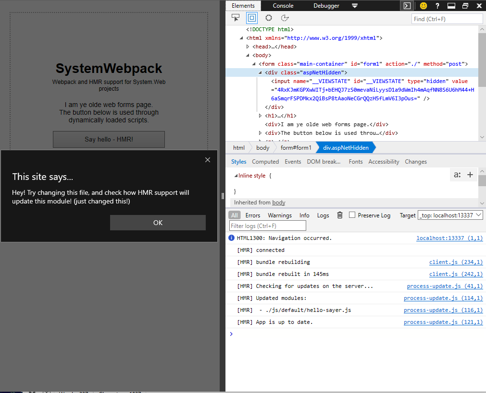

# SystemWebpack - Webpack dev server support for System.Web (old ASP.NET)
It is very nice that we have ASP.NET Core, and got nice toys to play with like built-in support for the Webpack dev server. But what about System.Web? So many projects are still built on the old ASP.NET framework, where we don't have Webpack dev server support.

This library aims to fix that. This library provides support for the good parts of Webpack in System.Web projects. This library is heavily inspired by [Microsoft.AspNetCore.JavascriptServices](https://github.com/aspnet/JavaScriptServices) and in fact uses much code from that project.

## Features

Works on .NET 4.5.2 and higher.

Support for:
- Webpack dev middleware
- Hot module replacement, for more information, view the [webpack docs](https://webpack.js.org/guides/hot-module-replacement/).

Used for development purposes only.

## Usage

Ensure you got the following node packages installed in your web project `package.json`:

- [`webpack`](https://www.npmjs.com/package/webpack)
- [`webpack-dev-middleware`](https://www.npmjs.com/package/webpack-dev-middleware)
- [`webpack-hot-middleware`](https://www.npmjs.com/package/webpack-hot-middleware) if you want to use [Hot Module Replacement](https://webpack.js.org/guides/hot-module-replacement/)
- [`aspnet-webpack`] - this is an interop package used for communicating with webpack

Install the package the package [from NuGet](https://www.nuget.org/packages/SystemWebpack):

    Add-Package SystemWebpack
	Add-Package WebActivatorEx

Add startup file (for instance: `App_Start/SystemWebpackConfiguration.cs`) to configure the library:

	[assembly: PreApplicationStartMethod(typeof(MyNamespace.SystemWebpackConfiguration), nameof(MyNamespace.SystemWebpackConfiguration.Configure))]

	namespace MyNamespace {
		using SystemWebpack;

		public static class SystemWebpackConfiguration {
			public static void Configure() {
				WebpackSupport.Enable(new WebpackOptions {
					HotModuleReplacement = true
				});
			}
		}
	}

Modify your web.config:

	<system.webServer>
		<handlers>
		  <!-- These handlers are required so the Webpack HTTP module can capture these requests. An alternative would be to use
			   system.webServer/modules@runManagedModulesForAllRequests but you might not want to use that for your project
           
			   By mapping these paths to the built-in StaticFileHandler we force that managed modules are run for these requests.
		   -->
		  <add name="WebpackDevJsonHandleModule" verb="*" path="*.json" type="System.Web.StaticFileHandler"/>
		  <add name="WebpackDevJsHandleModule" verb="*" path="*.js" type="System.Web.StaticFileHandler"/>
		  <add name="WebpackDevHmrHandleModule" verb="*" path="__webpack_hmr" type="System.Web.StaticFileHandler"/>
		  <add name="WebpackDevBuildHandleModule" verb="*" path="build/*" type="System.Web.StaticFileHandler"/>
		</handlers>
	</system.webServer>
	<location path="__webpack_hmr">
		<system.web>
		  <httpRuntime executionTimeout="3600" enableKernelOutputCache="false"/>
		</system.web>
		<system.webServer>
		  <urlCompression doDynamicCompression="false" doStaticCompression="false"/>
		</system.webServer>
	</location>

Ready to go!

## Building the project
To build the project ensure you have:

- .NET Framework 4.5.2 or higher installed
- Visual Studio with Web Development tools
- Powershell 4 or higher

To build the project simply run:

    build

To build the project simply run:

    build -Target NuGet-Pack

## Contributions
This project is accepting contributions. Please keep the following guidelines in mind:

- Add tests for new code added
- Keep in line with the existing code style
- Don't reformat existing code
- Propose new features before creating pull requests to prevent disappointment